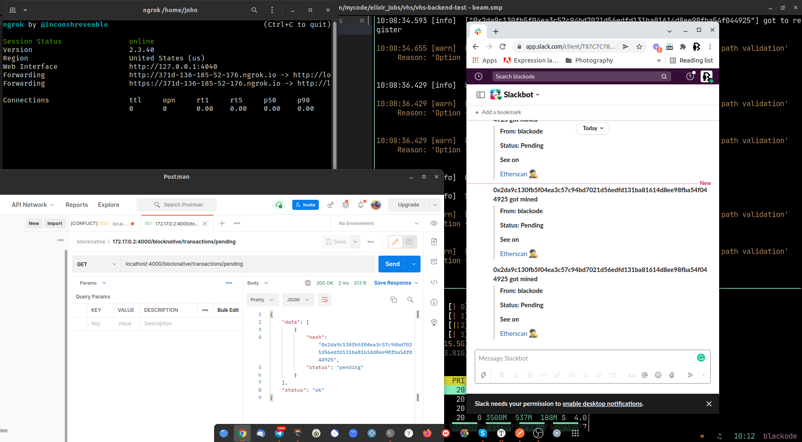

# Welcome VHS



## Project Highlighted Module

### Vhs.Servers.Transaction

This module simulates a Transaction Server for registering, updating and listing transactions using `GenServer`

It will start as soon as our `vhs` app started

## Development Technologies

At the moment of developing this project, I used the following versions of
Elixir and Erlang.

```elixir
iex> mix hex.info

Hex:    0.21.2
Elixir: 1.12.2
OTP:    24.0.4

Built with: Elixir 1.11.4 and OTP 21.3

```

## Starting Application

To start the server:

- Install dependencies with `mix deps.get`
- Create and migrate your database with `mix ecto.setup`
- Install Node.js dependencies with `npm install` inside the `assets` directory
- Start Phoenix endpoint with `mix phx.server`

Now you can visit [`localhost:4000`](http://localhost:4000) from your browser.

## API EndPoints

- POST `/blocknative/confirm` to watch transaction hash
- POST `/blocknative/webhook` webhook url to receive transaction updates
- POST `/blocknative/transactions/pending` to list the all pending transactions

  ```json{
    "data": [
        {
            "hash": "0x51d49ccc52e0d00941f86a1bd67e020162a6e1041b4e904ecdae03ebf0f1a907",
            "status": "pending"
        }
    ],
    "status": "ok"
  }
  ```

## Expose a local web server to the internet

The `ngrok` will allow local webserver running to internet. So, we can use our local webserver url as webhook url at `blocknative`.

run the following command

```shell
ngrok http 4000
```

You will see the following output.

```
Session Status                online
Version                       2.3.40
Region                        United States (us)
Web Interface                 http://127.0.0.1:4040
Forwarding                    http://14fc-136-185-52-176.ngrok.io -> http://localhost:4000
Forwarding                    https://14fc-136-185-52-176.ngrok.io -> http://localhost:4000
Connections                   ttl     opn     rt1     rt5     p50     p90
```

The urls may look different as `ngrok` assigns random hexadecimal names to the HTTP tunnels it opens.  
Here the url is `http://14fc-136-185-52-176.ngrok.io` which will act our webhook base.

Make sure you add `http://14fc-136-185-52-176.ngrok.io/blocknative/webhook` as webhook url for `blocknative`.

## Project Challenges

- API Integration (Blocknative) Implementation
- Transaction Server callbacks for updating the transaction status.

## TIL

- Learned how to use localhost web server as `webhook` using `ngrok`

## Overall Project Experience

I felt it is a well framed to test core concepts of Elixir as project made me to code in all the core concepts of Elixir like `GenServers`, `Enumaration`, `collections`, `webhooks`.

## What I enjoyed?

I really enjoyed coding webhooks and notifying over slack.

Thank You :)

Best Regards,
Ankanna
